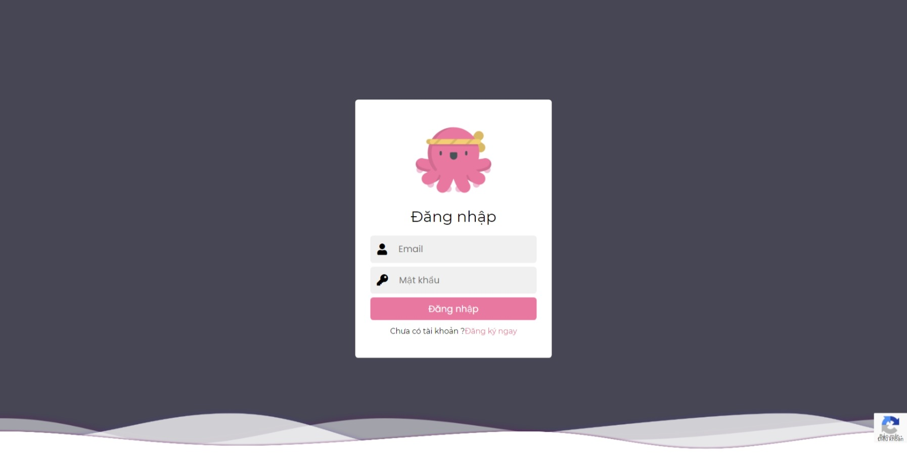
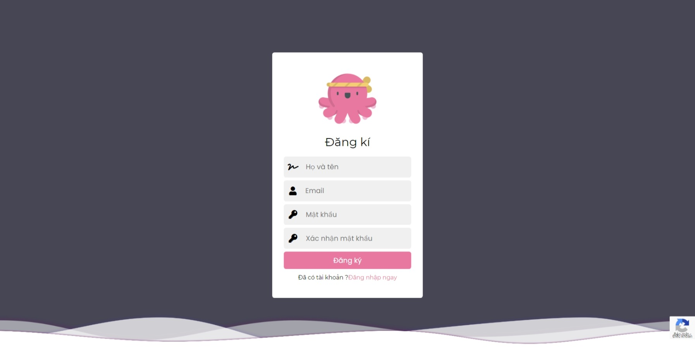
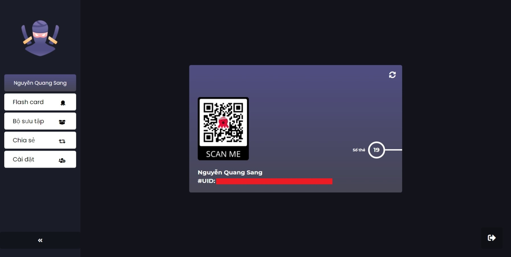
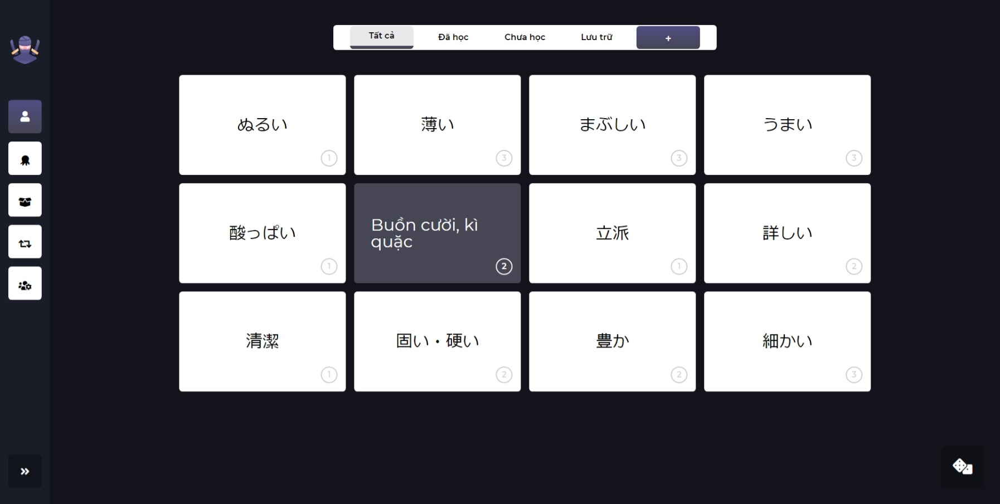
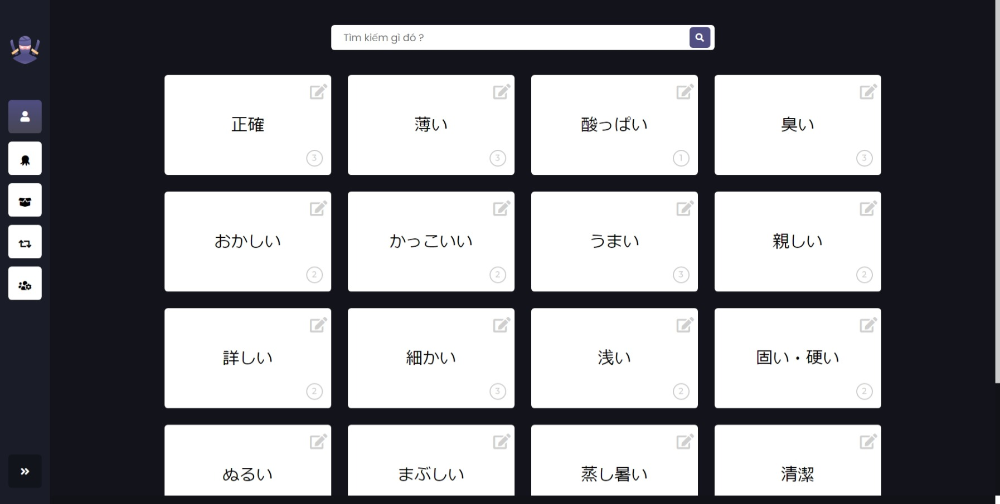
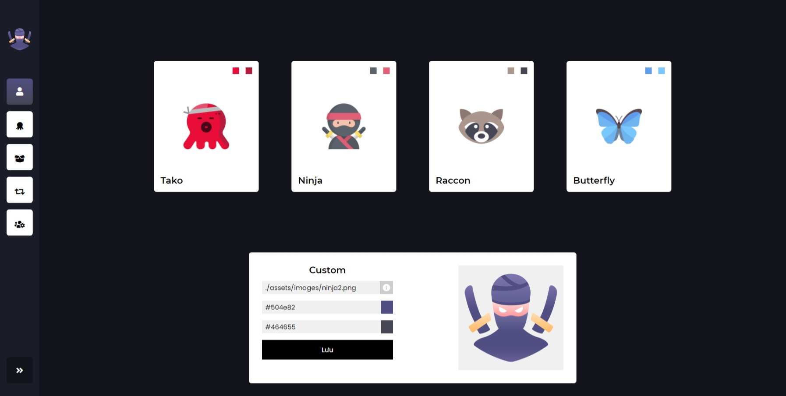

# Tako Flashcard
## Tako Flashcard là gì ?
- Một ứng dụng flashcard nho nhỏ sử dụng Firebase Realtime Database nho nhỏ mà mình thực hiện.
## Sử dụng
- Truy cập thông qua url [Tako Flashcard](https://sangcamap.tech/)
## Tính năng chính
- Tạo thẻ flashcard (không giới hạn số mặt, số lượng)
- Phân loại thẻ flashcard
- Đăng nhập, đăng ký
- Mỗi user sử dụng một nhánh dữ liệu riêng 
- Tùy chỉnh giao diện 
## Giao diện 
Đăng nhập

Đăng ký

Tài khoản

Flashcard Playground

Bộ sưu tập

Tùy chỉnh giao diện

